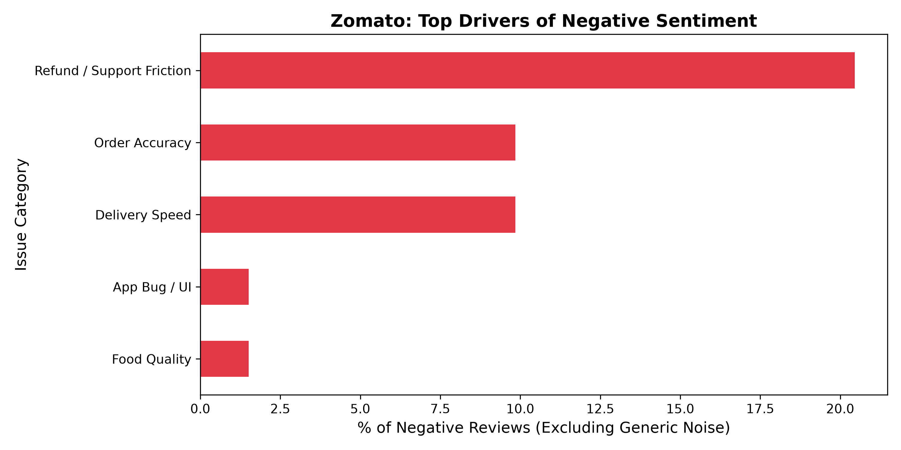
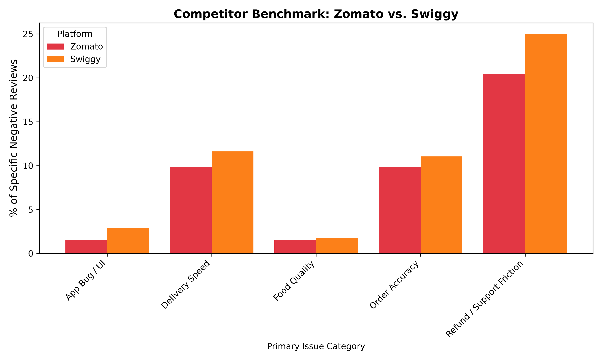

# Zomato Order Accuracy & Refund Trust Gap: A Data-Driven Case Study

## 📌 Executive Summary

*   **The Pivot:** I initially hypothesized that a Dietary Preference Filter would drive user value (based on an exploratory sample of N=60). However, expanding the dataset to 500+ recent reviews across competitors revealed a much deeper operational bottleneck.
*   **The Core Problem:** Automated thematic coding of 1-3 star reviews showed that **Refund/Support Friction and Order Accuracy defects account for over 30% of actionable negative sentiment** across both Zomato and Swiggy.
*   **The Recommendation:** I shifted the project priority from discovery features to operational trust. I am proposing an automated, photo-verified refund flow to bypass restaurant arbitration delays, projecting a significant rescue of churned Daily Active Users (DAU).

---

## 🔄 Research Evolution & Hypothesis Testing

*   **Phase 1 (Exploratory Sample, N=60):** Early review mining highlighted user interest in enhanced discovery features, leading to an initial RICE prioritization of a Dietary Preference Filter.
*   **Phase 2 (Expanded Quantitative Dataset, N=500+):** Expanding the dataset and applying automated thematic coding revealed that operational defects—specifically Order Accuracy and Refund Friction—were far more critical drivers of churn.
*   **Outcome:** The RICE matrix was updated to reflect the expanded dataset, pivoting the primary feature candidate toward solving operational trust and revenue retention.

---

## 🛠️ Data Pipeline & Methodology

To avoid relying on anecdotal feedback, I built an automated extraction and classification pipeline:

*   **Data Extraction:** Scraped the latest 500 reviews for both Zomato and Swiggy using Python and the `google-play-scraper` library.
*   **Data Transformation:** To process the qualitative data efficiently and at scale, I defined strict issue categories and used an LLM-assisted Python script to perform automated thematic coding across the unstructured text.
*   **Analysis:** Filtered for 1-3 star reviews to quantify the exact drivers of negative sentiment and normalized the data to ensure a fair competitor comparison.

---

## 📊 Findings & Competitor Benchmark

### 1. Zomato's Primary Drivers of Negative Sentiment

> **Key Insight:** Vague complaints aside, "Refund / Support Friction" is the single largest specific driver of negative sentiment (~20.5%), followed closely by "Order Accuracy" (~9.8%). Users are highly frustrated by being trapped in bot loops or offered small coupons when restaurants forget items.

### 2. Industry Benchmark: Zomato vs. Swiggy

> **Key Insight:** Benchmarking against Swiggy reveals this is an industry-wide structural defect, not an isolated Zomato bug. Swiggy actually sees higher relative friction in these categories (36% combined). This presents a massive strategic opportunity for Zomato to capture market share by solving the refund trust gap before its primary competitor does.

---

## 💡 Feature Prioritization (RICE Framework)

Based on the expanded data, I evaluated engineering solutions to solve this structural bottleneck and compared them against the initial discovery feature hypothesis.

| Feature Candidate | Reach (1-10) | Impact (1-3) | Confidence (%) | Effort (Weeks) | **RICE Score** |
| :--- | :--- | :--- | :--- | :--- | :--- |
| **A: Auto-Refund Proof (Order Accuracy)** | 8 | 3 | 90% | 4 | **5.4** |
| **B: Priority Escalation Path** | 3 | 2 | 70% | 2 | **2.1** |
| **C: Dietary Preference Filter** *(Initial V1 Hypothesis)* | 4 | 1 | 60% | 3 | **0.8** |

**Recommendation:** Proceed with Feature A. While the engineering effort is higher, the direct impact on preventing hard user churn makes it the clear mathematical priority.

---

## 📈 Business Impact Estimate

To quantify the Return on Investment (ROI) of building the Auto-Refund Proof feature, I modeled the estimated retention impact:

*   **Baseline Assumption:** Zomato processes orders for ~10M Monthly Active Users (MAU).
*   **Defect Rate:** Assuming 2% of user orders experience an accuracy or missing item defect (200,000 users affected/month).
*   **Churn Risk:** Industry data suggests ~20% of users who experience an unresolved refund dispute stop using the platform entirely (40,000 users at risk of churning per month).
*   **Impact Delta:** If the automated feature resolves even 50% of these disputes instantly, Zomato successfully retains **20,000 active users per month** who would have otherwise churned to a competitor.

---
*Prepared by Ashutosh*
